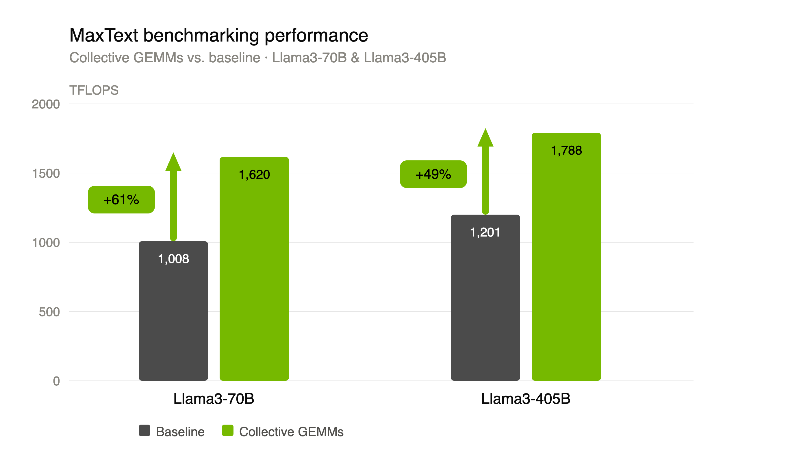

# Collective GEMMs in Tensor Sequence Parallelism

<small style={{ opacity: 0.7 }}>By Seonghee Lee, Deep Patel, Tejash Shah, Phuong Nguyen, and Abhinav Goel</small>

> **TL;DR** — Tensor-sequence parallelism leaves an all-gather and a reduce-scatter exposed at every layer boundary, so GPUs idle while they wait on communication. Collective GEMMs fuse each collective with the GEMM next to it and chunk both along the sequence dimension, letting the multiply work on the tokens that have already arrived. In MaxText this is two configuration flags, and it raises training throughput by 61% on Llama3-70B and 49% on Llama3-405B.

## Introduction

Training large language models at scale requires distributing work across many GPUs. But distribution comes at a cost: GPUs must constantly communicate to stay synchronized, and every moment spent waiting on communication is a moment not spent on compute. Tensor-sequence parallelism is one of the leading strategies for scaling dense models across large GPU clusters, but its reliance on exposed collective operations limits GPU utilization.

Collective GEMMs address this directly by overlapping communication and compute. **Collective GEMMs on MaxText deliver 1008 → 1620 TFLOPS on Llama3-70B and 1201 → 1788 TFLOPS on Llama3-405B, a 61% and 49% speedup over baseline, respectively.** In this blog, we talk about the technical details of collective GEMM operations in MaxText and how you can easily enable this on your models.



## What is tensor-sequence parallelism (TPSP)?

### Background: distributed training

A distributed training step divides into compute and communication.

Compute is dominated by GEMMs (`Y = XW`), where `W` holds learned weights and `X`, `Y` are activations. The forward pass moves through these GEMMs to compute attention and MLP outputs; the backward pass runs them again to produce gradients.

Communication is the cost of splitting that work. No single GPU can hold all the model state and activations at scale, so they are sharded across multiple GPUs. Optimizing that movement is what determines training efficiency.

### Tensor parallelism

Tensor parallelism splits the weight matrices (`W`) of each linear layer across GPUs. Within a transformer layer, this applies inside the attention block and the MLP block — the dotted green regions in Figure 1. Each region pairs a column-wise split with a row-wise one: `W_qkv` and the MLP up-projection are split along their output dimension (column-wise split), `W_o` and `W_down` along their input dimension (row-wise split). The row-wise split leaves each GPU holding only a partial sum of the output `Y`, so it must be exchanged across the tensor-parallel group before the next GEMM can run. This introduces two communication operations, `f` and `f̄`, at the boundary of every attention and MLP block [1].


*Figure 1. Tensor parallelism in a transformer layer. Regions in the attention block and the MLP block are each sharded across the tensor-parallel group: weights are split across GPUs, and so are the activations produced inside the block. Two collectives connect the regions: `f` is a no-op in the forward pass and an all-reduce in the backward pass, `f̄` the reverse. Diagram adapted from Korthikanti et al. [1].*

### Sequence parallelism

Tensor parallelism only covers operations that have a weight matrix to shard. LayerNorm, dropout, and residual additions do not, so under tensor parallelism alone they run redundantly on a full replicated copy of the activations [1]. Sequence parallelism shards those regions along the sequence dimension instead, so each GPU works on a local slice of tokens. The same tensor-parallel group is resharded on a different axis at each boundary, so the all-reduce at the block output becomes a reduce-scatter, paired with an all-gather before the next GEMM.

### Tensor parallelism and sequence parallelism combined

Tensor-sequence parallelism is tensor parallelism and sequence parallelism combined on the same group of GPUs. In tensor-sequence parallelism, these two strategies alternate through each transformer layer, connected by reduce-scatter and all-gather collectives that transition activations between the two sharding regimes. The result is that both weight memory and activation memory scale with the number of GPUs, enabling strong-scaling of dense models to large GPU counts without the memory walls that limit data parallelism alone.


*Figure 2. Tensor-sequence parallelism in the same transformer layer. The regions alternate. Inside the tensor-parallel regions, the weight matrices are split across the group and the activations they produce are split on the hidden dimension. Inside the sequence-parallel regions sit LayerNorm, dropout, and the residual additions, which have no weight matrix to shard; because each operates on one token at a time, the activations are split along the sequence dimension instead. The same GPUs serve both regimes, and `g` and `ḡ` convert between them: `g` is an all-gather in the forward pass and a reduce-scatter in the backward, `ḡ` the reverse. Diagram adapted from Korthikanti et al. [1].*

## The problem with TPSP: exposed collectives reduce GPU utilization

The fundamental challenge with TPSP is that the reduce-scatter and all-gather collectives sitting at each layer boundary (`g` and `ḡ` in Figure 2) are *exposed* — meaning compute must wait for communication to finish before it can proceed. Before a GEMM can begin, the all-gather must complete so that every GPU has the full activation tensor. After the GEMM, the reduce-scatter must complete before the next layer's sequence-parallel operations can start. On large clusters with many GPUs, these collectives become increasingly expensive as more devices participate in the synchronization.

The result is that GPUs sit idle during communication, directly reducing utilization and throughput. If the GEMM could begin processing the portions of the activation that have already arrived, rather than waiting for the full tensor, we can make communication more efficient. This is the core idea behind collective GEMMs.

## Collective GEMMs (CGEMM)


*Figure 3. Collective GEMM operations: all-gather `g` + GEMM, and GEMM + reduce-scatter `ḡ`. Chunking gives the all-gather end a head start with no tail, so it hides fully; the reduce-scatter end has neither, so a head and a tail remain exposed.*

Ordinarily, the collective and the GEMM are separate operations that run one after the other: the all-gather `g` finishes moving the whole tensor, then the GEMM starts multiplying. A collective GEMM fuses them into one operation and cuts both into chunks — slices of the tensor along the sequence dimension, a subset of the tokens each — so the multiply can work on the chunks that have already arrived while the rest are still in flight.

**All-gather `g` + GEMM, at the start of a region.** The all-gather sits before the GEMM, so ordinarily the GEMM would wait for it. But each GPU already holds its own token chunk, so it can start multiplying that chunk the moment the all-gather is issued, while the other `t−1` chunks are still in flight. As each remote chunk lands, the GEMM runs on it. The gathered dimension is tokens, so every chunk produces a distinct set of output rows and results are written straight into their place in the output, with no accumulation needed.

**GEMM + reduce-scatter `ḡ`, at the end of a region.** The reduce-scatter sits after the GEMM, so there is nothing to send until some compute is done. The row-wise GEMM produces a partial sum covering every token range, so it can be computed one range at a time. As soon as the rows for the first range are finished, those rows can be summed across the group and delivered to the GPU that owns them, while the rows for the next range are still being computed.

### Choosing the chunk count

CGEMM requires splitting the work into chunks — slices of the tensor. More chunks mean finer-grained overlap and less exposed tail. However, a GEMM chunk that is too small cannot fill the tensor cores, so there is not enough work to hide memory latency, and the kernel spends its time on launch and setup rather than math. A transfer that is too small runs into the same problem on the network: fixed per-message overhead stops being amortized, so effective bandwidth drops. Past some point those two losses exceed what the overlap saves. The target is a boundary that costs roughly `max(compute, communication)` instead of their sum.

## MaxText + TransformerEngine: collective GEMM integration

MaxText integrates collective GEMMs through its TransformerEngine quantization path. Rather than scheduling the all-gather and GEMM as sequential operations, the collective GEMM implementation tiles both the collective and the matrix multiply along the same dimension, allowing each tile's communication and compute to overlap. This is implemented inside MaxText's quantization layer and is exposed to users through a single configuration flag.

### Enabling collective GEMMs in MaxText

Two flags control the behavior:

```bash
# Enable TE FP8 quantization with collective GEMM overlap in MLP layers only
python train.py configs/llama3_405b.yml \
    quantization=te_fp8_currentscaling \
    te_comm_gemm_overlap=MLP_ONLY

# Enable collective GEMM overlap in both MLP and Attention layers
python train.py configs/llama3_405b.yml \
    quantization=te_fp8_currentscaling \
    te_comm_gemm_overlap=FULL

# Disable collective GEMM overlap (baseline, exposed collectives)
python train.py configs/llama3_405b.yml \
    quantization=te_fp8_currentscaling \
    te_comm_gemm_overlap=DISABLED
```

Supported quantization recipes are:

| Flag | Recipe |
|------|--------|
| `te_fp8_currentscaling` | FP8 with current scaling (recommended) |
| `te_fp8_delayedscaling` | FP8 with delayed scaling |
| `te_mxfp8` | MXFP8 block scaling |
| `te_nvfp4` | NVFP4 block scaling |

### How it works under the hood

MaxText's `quantizations.py` inspects the mesh axes of each GEMM call at runtime to determine which collective op to use. The logic is straightforward — the sharding axis names tell it whether an all-gather or reduce-scatter is needed:

```python
def generate_collective_op_set(self, mesh_axes):
    if overlap_policy == TeCommGemmOverlapPolicy.DISABLED:
        return tex.noop_collective_op_set

    if mesh_axes[0] == "embed" and mesh_axes[-1] == "mlp":
        # First MLP linear: sequence-sharded input, gather before GEMM
        return tex.CollectiveOpSet.create(tex.CollectiveOp.ALL_GATHER)

    elif mesh_axes[0] == "mlp" and mesh_axes[-1] == "embed":
        # Second MLP linear: scatter result back to sequence sharding
        return tex.CollectiveOpSet.create(tex.CollectiveOp.REDUCE_SCATTER)

    elif overlap_policy == TeCommGemmOverlapPolicy.FULL:
        # Attention layers: same pattern for QKV and output projections
        if mesh_axes[0] == "embed" and mesh_axes[-1].startswith("kv"):
            return tex.CollectiveOpSet.create(tex.CollectiveOp.ALL_GATHER)
        elif mesh_axes[0] == "heads" and mesh_axes[-1] == "embed":
            return tex.CollectiveOpSet.create(tex.CollectiveOp.REDUCE_SCATTER)

    return tex.noop_collective_op_set
```

This means the overlap policy applies symmetrically to the all-gather before the GEMM and the reduce-scatter after it. With `MLP_ONLY`, only the two MLP GEMMs per layer are overlapped. With `FULL`, all four GEMMs per transformer layer — QKV projection, output projection, and both MLP linears — are overlapped.

The collective op set is then passed directly into TransformerEngine's dense call:

```python
return transformer_engine.jax.dense.dense(
    x,
    kernel,
    contracting_dims=contracting_dims,
    quantizer_set=quantizer_set,
    collective_op_set=collective_op_set,  # overlap happens here
)
```

The full TransformerEngine JAX examples, including multi-process launch scripts and tests across BF16, FP8, and MXFP8, are available at `examples/jax/collective_gemm/`.

## Results

{/* TODO: add the measurement setup for these numbers — GPU model and count,
    TP/SP degree, sequence length, per-device batch size, container tag, and
    which overlap policy (MLP_ONLY or FULL) produced them. */}

| Model | Baseline | Collective GEMMs | Speedup |
|-------|----------|------------------|---------|
| Llama3-70B | 1008 TFLOPS | 1620 TFLOPS | 61% |
| Llama3-405B | 1201 TFLOPS | 1788 TFLOPS | 49% |

## Conclusion

Collective GEMMs in MaxText, powered by TransformerEngine, make communication-compute overlap accessible via two configuration flags. This eliminates the exposed collectives that limit GPU utilization in tensor-sequence parallel training. Collective GEMMs on MaxText deliver 1008 → 1620 TFLOPS on Llama3-70B and 1201 → 1788 TFLOPS on Llama3-405B, a 61% and 49% speedup over baseline, respectively. As models and clusters continue to scale, hiding collective latency behind useful compute becomes essential, and this integration makes that straightforward to enable.

## Acknowledgements

{/* TODO: replace with the actual names and teams before publishing. */}

We would like to thank the TransformerEngine and MaxText teams at NVIDIA and Google, whose efforts made this integration possible.

## References

[1] V. Korthikanti et al., "Reducing Activation Recomputation in Large Transformer Models," [arXiv:2205.05198](https://arxiv.org/abs/2205.05198).

## Links

To learn more about collective operations, check out the NVIDIA documentation on [collective operations](https://docs.nvidia.com/deeplearning/nccl/user-guide/docs/usage/collectives.html).
