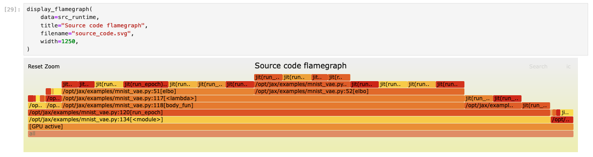

# `nsys-jax` wrapper for Nsight Systems
`nsys-jax` refers to a small ecosystem of Python-based tools for collecting and analysing Nsight Systems profiles of
JAX programs.
There are two command-line tools:
- `nsys-jax`, which wraps `nsys profile` and bundles the resulting profile data with additional JAX/XLA-specific
   metadata that allows for richer programmatic analysis of the profile data.
- `nsys-jax-combine`, which combines multiple `nsys-jax` output files (for example, collected from different processes
  in the same multi-process/multi-node distributed JAX program) into a single output file, with de-duplication and
  consistency checks.

Behind the scenes, there is a small Python library (`jax_nsys`) for loading and analysing the output of `nsys-jax` and
`nsys-jax-combine`, which allows the use of standard data science packages like `numpy`, `pandas` and `matplotlib` to
explore profile data.

There are three convenient ways of running profile data analyses:
- `nsys-jax ... --nsys-jax-analysis ANALYSIS ... program.py`: after profile data have been collected, `ANALYSIS` will
  immediately be executed; results will be printed to the terminal and output data files will be embedded in the output
  archive (*i.e.* execution on the compute node immediately after execution)
- `nsys-jax-combine ... --analysis ANALYSIS ...`: after multiple `nsys-jax` outputs have been combined, `ANALYSIS` will
  be executed on the merged output; results will be printed to the terminal and output data files will be embedded in
  the output archive (*e.g.* execution somewhere inside the compute cluster that has access to all processes' outputs)
- Manual execution; the output files of both `nsys-jax` and `nsys-jax-combine` include an installation script that sets
  up a local Python virtual environment including the `jax_nsys` library, Jupyter Lab, and an example notebook for
  Jupyter-based exploration of profile data (*e.g.* run this on your laptop and explore your profile data in a Jupyter
  notebook)

## Installation
The containers published from this repository (`ghcr.io/nvidia/jax:XXX`) have `nsys-jax` pre-installed; the recipes for
building these are public and can be used as a point of reference if you want to install `nsys-jax` in your own
containers.

### Manual installation
The main installation step is simply
```console
$ pip install git+https://github.com/NVIDIA/JAX-Toolbox.git#subdirectory=.github/container/jax_nsys
```
or, for an editable install from a specific branch/tag/commit:
```console
$ pip install --src /checkout-dir -e 'git+https://github.com/NVIDIA/JAX-Toolbox.git@main#subdirectory=.github/container/jax_nsys&egg=jax-nsys'
```
You may want to include this in a global `pip-compile`-based dependency resolution (as is done in the containers built
from this repository), rather than running too many ad-hoc `pip install` commands.

This will install all of the components mentioned so far, but does not currently include all (implicit) dependencies:
- `protoc` must be installed at a version compatible with the `google.protobuf` runtime library; `nsys-jax` includes a
  helper script that can be run after `pip install`, e.g. to install `/usr/local/bin/protoc`, run
  `install-protoc /usr/local`.
- Nsight Systems's multi-report analysis system is used by `nsys-jax` internally and has some additional dependencies
  that are not bundled in the Nsight Systems installation
  ([doc](https://docs.nvidia.com/nsight-systems/InstallationGuide/index.html#installing-multi-report-analysis-system)),
  these are listed in `<nsys_install_dir>/target-linux-x64/python/packages/nsys_recipe/requirements/common.txt` and can
  be installed with `pip install -r /path/to/common.txt` or by including it in your global `pip-compile`-based
  dependency resolution.
- To interpret metadata dumped from XLA, `nsys-jax` needs `.proto` files from XLA that are not included in the JAX
  installation. If the relevant XLA source tree is not checked out at `/opt/xla`, the environment variable XXX should
  be set to point to it.
- A small patch to some Python files included in the installations of Nsight Systems versions 2024.5 and 2024.6 is
  needed for compatibility with `nsys-jax`, this can be applied by running the `nsys-jax-patch-nsys` command and will
  not be required in other versions of Nsight Systems.

Only `protoc` is always needed, the remaining dependencies are only required when actually collecting profile data with
the `nsys-jax` command, but not when merging collected profile data with `nsys-jax-combine` or running local analyses
of profile data.

## Collecting profile data

The `nsys-jax` command loosely corresponds to `nsys profile`, as introduced in
[the generic profiling documentation](./profiling.md).
Simply run `nsys-jax python my_program.py`.
If you want to pass additional options to `nsys profile`, the syntax is
`nsys-jax [nsys profile options] -- python my_program.py`; the `--` is compulsory.

`nsys-jax` collects additional JAX/XLA metadata from the program being profiled and automatically performs some
post-processing of the profile data to faciliate programmatic analysis.

It is usually a good idea to set the profile names to something meaningful using the `--output` (`-o`) option.
The syntax supported by `nsys-jax` is slightly more restricted than what `nsys` supports; only `%q{ENV_VAR}` expansions
are supported.
An example when using the Slurm job orchestrator is:
`nsys-jax -o /out/job%q{SLURM_JOB_ID}/step%q{SLURM_STEP_ID}/rank%q{SLURM_PROCID} -- python my_program.py`
which will result in an output archive `/out/job42/step7/rank0.zip` that contains `rank0.nsys-rep` and other metadata.

As well as running `nsys profile`, this automatically sets some configuration variables mentioned above, such as
`JAX_TRACEBACK_IN_LOCATIONS_LIMIT`, and sets XLA flags requesting that metadata be saved in Protobuf format.

> **Important**: because `nsys-jax` manipulates the `XLA_FLAGS` environment variable, you must make sure that this is
> not overwritten inside the executable that you pass. For example `nsys-jax python my_program.py` is fine, but
> `nsys-jax my_script_to_overwrite_xla_flags_and_run_my_program.sh` may not be.

The only XLA flag that `nsys-jax` will **overwrite** is `--xla_dump_to`, which sets the output directory for the
Protobuf metadata. `nsys-jax` additionally changes the default value of `--xla_dump_hlo_as_proto` (`true`), but will
not modify this if it has been set explicitly.

> **Note**: because the Protobuf metadata is written at compilation time, using the JAX persistent compilation cache
> prevents it from being written reliably. Because of this `nsys-jax` sets `JAX_ENABLE_COMPILATION_CACHE` to `false` if
> it is not explicitly set.

After collecting the Nsight Systems profile, `nsys-jax` triggers two extra processing steps:
- the `.nsys-rep` file is converted into a `.parquet` and a `.csv.xz` file for offline analysis
- the metadata dumped by XLA is scanned for references to Python source code files -- i.e. your JAX program and the
  Python libraries on which it depends. Those files are copied to the output archive.

Finally, a compressed `.zip` archive is generated. The post-processing uses a local, temporary directory. Only the
final archive is written to the given output location, which is likely to be on slower, shared storage.

## Offline analysis
Copy an `nsys-jax` archive to an interactive system, and extract it. At the top level, there is an `install.sh` script
that will create a Python virtual environment containing Jupyter Lab and the dependencies of the `Analysis.ipynb`
notebook that is also distributed in the archive. Run this and the suggested launch command for Jupyter Lab.

The included notebook is intended to be a template for programmatic analysis of the profile data in conjunction with
the metadata from XLA. Out of the box it will provide some basic summaries and visualisations:


Examples include summaries of compilation time, heap memory usage, and straggler analysis of multi-GPU jobs.

You can see a rendered example of this notebook, as generated from the `main` branch of this repository, here:
https://gist.github.com/nvjax/e2cd3520201caab6b67385ed36fad3c1#file-analysis-ipynb.

> **Note**: this code should be considered unstable, the bundled notebook and its input data format may change
> considerably, but it should provide a useful playground in which to experiment with your own profile data.
