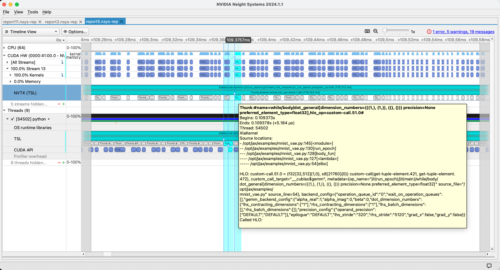

# Profiling JAX programs on GPU
This page aims to complement the [Profiling JAX programs](https://jax.readthedocs.io/en/latest/profiling.html) page in
the main JAX documentation with advice specific to profiling JAX programs running on NVIDIA GPUs.

[As mentioned on that page](https://jax.readthedocs.io/en/latest/profiling.html#nsight), the
[NVIDIA Nsight tools](https://developer.nvidia.com/tools-overview) can be used to profile JAX programs on GPU.

The two tools that are most likely to be relevant are [Nsight Systems](https://developer.nvidia.com/nsight-systems) and
[Nsight Compute](https://developer.nvidia.com/nsight-compute).

Nsight Systems provides a high level overview of activity on the CPU and GPU, and is the best place to start
investigating the performance of your program.
It has small overheads and should not significantly affect the execution time of your program.

Nsight Compute, on the other hand, enables detailed performance analysis of individual GPU kernels.
It repeatedly re-runs the kernel(s) in question to collect different metrics, resulting in an overall program execution
time that is much slower.
This is a powerful tool to use if you have identified specific GPU kernels that are executing surprisingly slowly.
This document does not currently describe its use in any detail; more information is available in
[the documentation](https://docs.nvidia.com/nsight-compute/index.html).

## Nsight Systems
The JAX-Toolbox containers already contain the most recent version of Nsight Systems.
You can also install it yourself from [here](https://developer.nvidia.com/nsight-systems/get-started), or use the
package repositories [here](https://developer.download.nvidia.com/devtools/repos).
To collect a profile, simply launch your program inside `nsys`, for example:
```bash
$ nsys profile --cuda-graph-trace=node python my_script.py
```

This will produce an `.nsys-rep` file, by default `report1.nsys-rep`.

When collecting profiles from a multi-process program, the simplest approach is to collect one report per process and
start by analysing only one them.
Simple JAX programs follow an SPMD model, meaning that the reports should contain similar data.
Nsight Systems also supports [multi-report analysis](https://docs.nvidia.com/nsight-systems/UserGuide/index.html#multi-report-analysis),
if you need to drill into differences in performance between ranks.

### Opening report files
A good starting point is to open the report file in the Nsight Systems GUI.
This can be done in a few different ways.

#### Running the GUI on a local system
A common workflow is to collect profiles on a remote system that has attached GPUs, and then download the report files
to your local machine to view them.
The Nsight Systems GUI supports Linux, macOS and Windows.
This is a good option if your network connection to the remote system is slow or high latency, or if you can only
allocate GPU resources for a short time.

#### Running everything on a local system
If you want to run your JAX program **and** the GUI on the same system, it is possible to launch it directly from
inside the Nsight Systems GUI, on a GPU attached to the same machine [as documented here](https://docs.nvidia.com/nsight-systems/UserGuide/index.html#profiling-linux-targets-from-the-gui).

#### Other configurations
Some other permutations are available of using VNC or WebRTC to stream the GUI from a remote machine.
This avoids having to download the report files by hand.
Documentation is available [here](https://docs.nvidia.com/nsight-systems/UserGuide/index.html#container-support-on-linux-servers).

### Tuning JAX configuration for profiling
If your JAX Python program is structured in a way that leads to deep Python call stacks, for example because you have a
lot of wrapper layers and indirection, or because you use a framework that adds similar layers, the default number of
call stack frames recorded in the metadata by JAX may be too small.
You can remove this limit by setting:
```python
import jax
# Make sure NVTX annotations include full Python stack traces
jax.config.update("jax_traceback_in_locations_limit", -1)
```
or the `JAX_TRACEBACK_IN_LOCATIONS_LIMIT` environment variable. At the time of writing, the default limit is 10 frames.
If the limit is reached, the text formatting of merged stack traces will not work as expected.

### Collecting targeted profiles
While it is possible to record profiles of the entire application (as above), this is often not the best choice.
Because the execution of JAX programs is often quite repetitive, and there is non-trivial JIT compilation time and
one-off initialisation cost, it may be that it is only worth recording a few iterations, and that these are very fast
compared to the JIT overhead.
In this case, only enabling profile collection for the iterations of interest is more efficient.

To illustrate this, consider the following JAX example ([mnist_vae.py](https://github.com/google/jax/blob/bfd29f610218504fbb61966c507e8e4c7d9f978e/examples/mnist_vae.py#L131-L136)):
```python
  opt_state = opt_init(init_params)
  for epoch in range(num_epochs):
    tic = time.time()
    opt_state = run_epoch(random.PRNGKey(epoch), opt_state, train_images)
    test_elbo, sampled_images = evaluate(opt_state, test_images)
    print(f"{epoch: 3d} {test_elbo} ({time.time() - tic:.3f} sec)")
```
where by default we have `num_epochs = 100` ([link](https://github.com/google/jax/blob/bfd29f610218504fbb61966c507e8e4c7d9f978e/examples/mnist_vae.py#L86)).

Running this example prints something like
```
  0 -124.1731185913086 (1.472 sec)
  1 -116.52528381347656 (0.382 sec)
  2 -113.37870025634766 (0.382 sec)
  3 -110.11742401123047 (0.381 sec)
  4 -110.05367279052734 (0.382 sec)
...
```
so as a minimum we should skip the first iteration, which contains the JIT overhead, to get representative performance
numbers.

One way of doing this is to use the CUDA profiler API:
```python
from ctypes import cdll
libcudart = cdll.LoadLibrary('libcudart.so')
for epoch in range(num_epochs):
  if epoch == 2: libcudart.cudaProfilerStart()
  tic = time.time()
  ...
libcudart.cudaProfilerStop()
```
and reduce the number of epochs profiled, for example `num_epochs = 5`.

If we then tell `nsys` to listen to the CUDA profiler API, with a command like:
```bash
$ PYTHONPATH=/opt/jax nsys profile --capture-range=cudaProfilerApi --cuda-graph-trace=node --capture-range-end=stop python /opt/jax/examples/mnist_vae.py
```
then the resulting profile will only contain 3 iterations of the loop (5 total - 2 skipped).

With `--capture-range-end=stop`, `nsys` will stop collecting profile data at `cudaProfilerStop()` and ignore later calls to `cudaProfilerStart()`, but it will not kill the application.
The default value, `stop-shutdown`, will kill the application after `cudaProfilerStop()`; in this case, buffered output is sometimes not flushed to the console.
If you need to start and stop profiling multiple times in your application, you can pass `repeat`; in this case, a different report file will be written for each start-stop pair.
Documentation can be found [here](https://docs.nvidia.com/nsight-systems/UserGuide/index.html#cli-profile-command-switch-options).
 
### Understanding the Nsight Systems timeline
The example in the previous section yields a profile like:


The lower part of the screen (under "Threads (9)") shows the CPU timeline, while the upper part (under "CUDA HW") shows
the GPU timeline.
The "TSL" (CPU) and "NVTX (TSL)" (GPU) rows show annotations generated by JAX via XLA.
Each "XlaModule" range corresponds to a call of a JITed JAX function, with the nestest "Thunk" ranges providing more
granular detail.

Zooming in on the profile, we can clearly see the latency between kernel launches and their execution.
These correlations are shown by the light blue highlighted regions when you select a kernel or NVTX marker:


We can also see that JAX is using CUDA graphs, both from the `cuGraph*` calls in the CUDA API row, and from the
coloured outlines of kernels in the CUDA HW rows.
JAX's (XLA's) usage of CUDA graphs is not currently fully supported by the Nsight Systems UI, which leads to some
missing detail in the annotations for CUDA graph nodes.
This is shown by the magenta region in the figure above, and will be fixed in a future version of Nsight Systems.

More complete annotations can be obtained by adding `--xla_gpu_enable_command_buffer=` to the `XLA_FLAGS` environment
variable when collecting the profile, which will disable the use of CUDA graphs.
Depending on the JAX program, you will probably see a small slowdown when graphs are disabled; it's worth keeping in
mind the scale of this effect for your program.

Without CUDA graphs, metadata should be available for all kernels in the GPU timeline:


The tooltip contains information about the lines of your JAX program's Python source code that led to this kernel being
emitted, as well as the relevant HLO code.
[This page](https://openxla.org/xla/operation_semantics) may help to understand the HLO code.
Note that there are two different HLO fields in the tooltip: "HLO" and "Called HLO", where in this example the latter
is empty.
In the case of fused kernels, the "Called HLO" field shows the body of the fused computation.

If you double-click on an NVTX region in the timeline it will open in the Events View in the lower part of the screen,
with the tooltip content shown in the bottom right:


If you have previously opened a different row from the timeline in the Events View then double-clicking on a new row
may show a message "A selected event does not exist in the current Events View..."; follow the instructions in the
message to get the view shown in the screenshot.

### Custom NVTX annotations
The annotations described above are NVTX ranges (in the "TSL" domain) emitted by JAX via XLA.
You can also add your own custom NVTX ranges using the `nvtx` Python bindings.
If these are not already installed, `pip install nvtx` will install them.
A simple way of using these bindings is as a Python context manager:
```python
for _ in range(3):
  with nvtx.annotate("MyRange"):
    call_some_jax_code()
```
which will produce three ranges called MyRange under the default NVTX domain in the NSight Systems GUI.
Complete documentation [can be found here](https://github.com/NVIDIA/NVTX/blob/release-v3/python/docs/index.rst).

Using `nvtx` functions inside JITed JAX code is not supported and will not yield the expected results, so this only
makes sense for high-level annotations outside JIT regions.
Inside JIT regions you can use [`jax.named_scope`](https://jax.readthedocs.io/en/latest/_autosummary/jax.named_scope.html)
and [`jax.named_call`](https://jax.readthedocs.io/en/latest/_autosummary/jax.named_call.html).
These will not generate NVTX ranges, but they do allow you to add custom levels to the name stack show in the metadata
emitted by XLA, i.e. the names like `while/body/transpose[permutation=(1, 0)]` shown in the screenshot above.

## `nsys-jax` wrapper for Nsight Systems
The containers published from this repository (`ghcr.io/nvidia/jax:XXX`) now include an additional wrapper to help with
collecting Nsight Systems profiles of JAX programs.

Loosely this corresponds to `nsys profile` above, i.e. simply run `nsys-jax python my_program.py`. If you want to pass
additional options to `nsys profile`, the syntax is `nsys-jax [nsys profile options] -- python my_program.py`; the `--`
is compulsory.

`nsys-jax` collects additional JAX/XLA metadata from the program being profiled and automatically performs some
post-processing of the profile data to faciliate programmatic analysis.

It is documented in more detail [on this page](./nsys-jax.md).
